# App登録方法(新しいアプリを審査まで持っていく流れ)
まず， Unity上で，file>build setting を開きます．

- Company Name：あなたの会社名やサークル名，個人名などを入力します（例: MyCompany）．
入力する箇所

- Product Name: アプリの名前を入力します（例: Counter App）．
- Package Name (Android) / Bundle Identifier (iOS): アプリの固有IDです．通常，com.会社名.アプリ名 の形式で設定します．他のアプリと重複しないように注意してください．(例：com.mycompany.counterapp)

## Android編
### 1.Unityでビルド準備

file>build setting
Androidを選択し，Switch Platformを押す

player Settingの設定

- Package Name (パッケージ名): アプリの固有IDです。com.会社名.アプリ名 の形式で、全世界でユニークなIDを設定します（例: com.kanta.MyNiceApp）。
- Version: ユーザーに見えるバージョン名です（例: 1.0）。
- Bundle Version Code: ストアが新旧を判断するための内部的な番号です。アプリを更新するたびに、必ず1ずつ増やしてください（例: 1 → 2）。
- Target API Level: Googleが推奨する最新レベルに設定するのが望ましいです。Automatic (highest installed)にしておくのが簡単です。

キーストア(Keystore)の作成

これは「このアプリは確かにあなたが作りました」ということを証明するデジタル署名のファイルです。非常に重要で、一度失くすとアプリの更新ができなくなります。

Player Settings > Publishing Settings を開きます。

  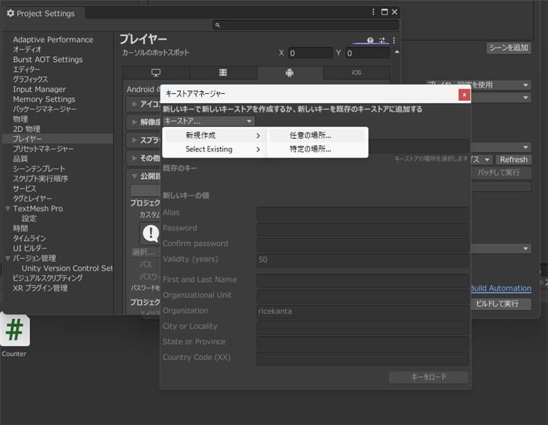

Keystore Manager... をクリックし、Keystore... > Create New > Anywhere を選択します。

保存場所を指定し、
- パスワード
- エイリアス（署名の名前）
- エイリアスのパスワード

  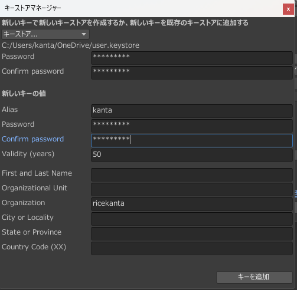

を設定します。このパスワードは絶対に忘れないでください。

作成が完了すると、Publishing Settingsの画面でキーストアとエイリアス、パスワードが自動で入力されます。

### 2.App Bundle(.aab)のビルド
現在，google playストアでは，.apkファイルではなく，効率的な.aab形式のアップロードが必須になっています。

File>Build Settingを開く

Build App Bundle(google play)のチェックボックスにチェックが入っていることを確認します．

  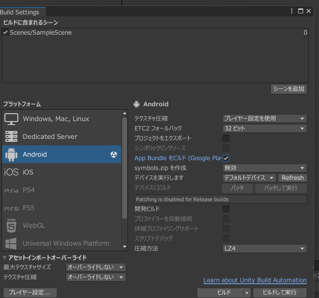

### 3.Google Play Consoleでアプリ登録とアップロード
作成した.aabファイルをストアに登録します．

1. Google Play Console にログインし，「すべてのアプリ」タブから「アプリ作成」をクリック
2. 基本情報の入力
- アプリ名
- 言語
- アプリ or ゲーム
- 有料 or 無料

  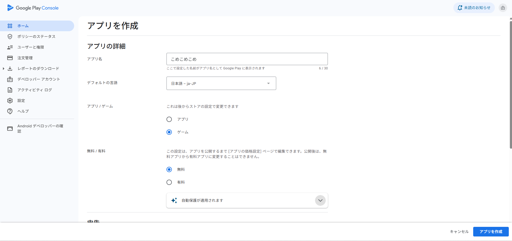

3. 画面の指示に従い，左上のメニューから順に埋めていきます。

- 内部テスト：主に自分の実機で行うテスト．アプリが正しくインストールできるか，基本的な動作ができるかテスト．
- ゲームの設定：
- クローズドテスト：より広範囲のユーザにアプリを試してもらうテスト．以下の条件がある．
1. 20人以上のテスターを集める．
2. テスターがオプトイン(テストの参加を表明)してから，継続して14日以上テストを実施する．
- 製品版：

  

  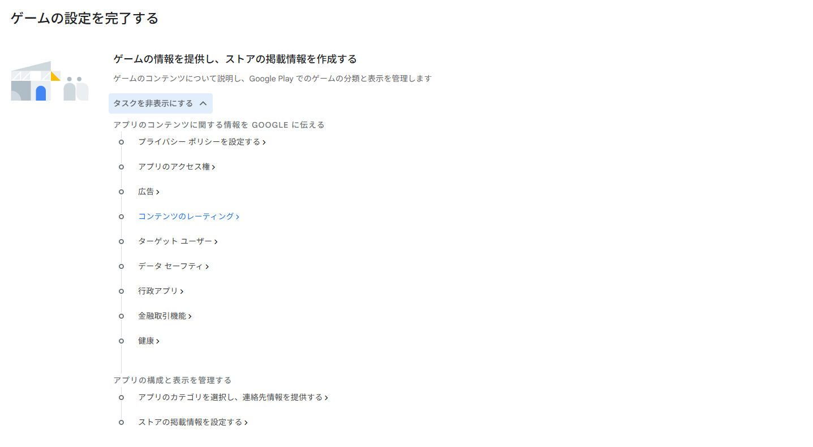

  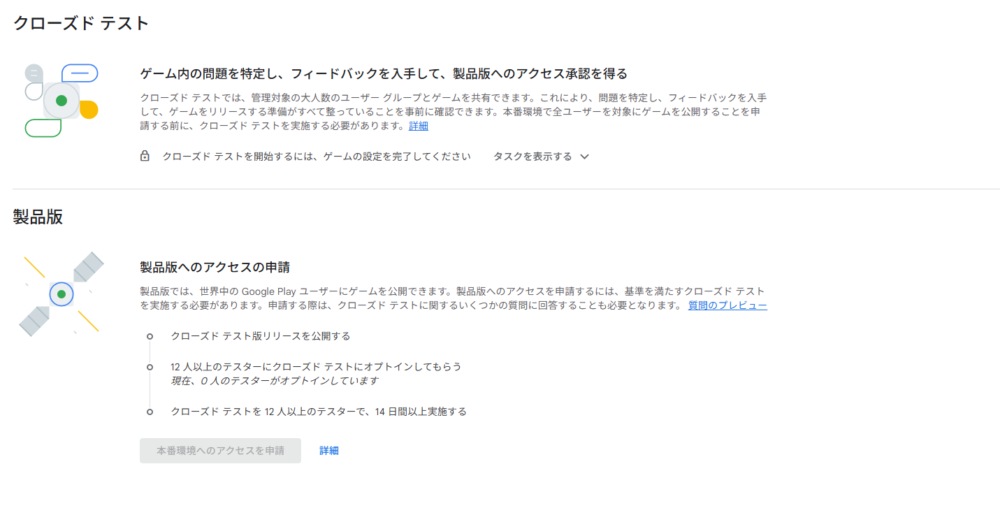

上記が，終了したらリリースの審査を行うことが可能．

初回のリリースには審査の時間が長く，大体３日かかり，長くて１週間

# 4.リリースについて詳しく
製品版のところをクリックし，「新しいリリースを作成」をクリックしてリリースを作成する．

  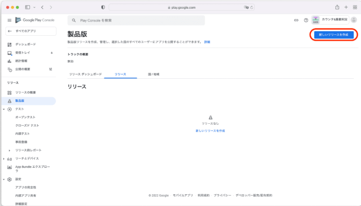

Unityのビルドで作成した.aabファイルをApp Bundleにアップロードします．
リリース名を入れて「リリースのレビュー」をクリック．

  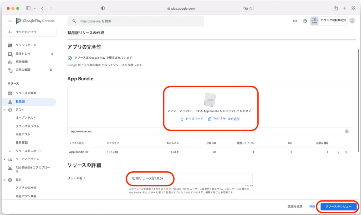

問題がなければ，「製品版として公開を開始」をクリックし，アプリをリリース．

  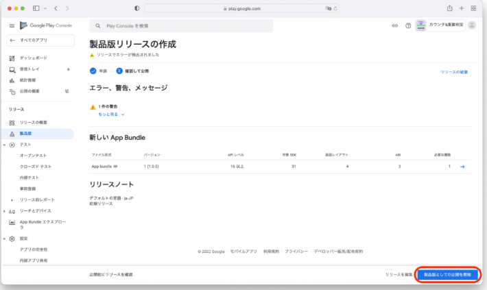

ステータスが審査中になれば成功

  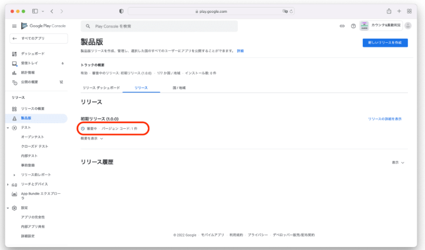

## IOS編
file>build setting
iosを選択し，Switch Platformを押す
Buildボタンを押し，保存先とファイル名を指定
XcodeプロジェクトをMacで開き，実機テストやAppStoreに申請ができる．

### 1.App Store Connectでアプリの箱を作る

App Store Connectにサインイン

MyAppを選択

内容

- プラットフォーム: 「iOS」にチェックを入れます。
- 名前: App Storeに表示されるアプリ名です．既に使用されている名前は使えない（例: すごいカウンターアプリ）。
- プライマリ言語: 「日本語」を選択します。
- バンドルID: UnityやXcodeで設定したcom.yourcompany.yourappname形式のIDをドロップダウンから選択します。（ここで表示されない場合、Xcodeでの設定がApple側にまだ認識されていない可能性があります）
- SKU: あなたが管理するための任意のIDです。ユーザには表示されない内部トラッキング用にアプリに与える一意のID。分かりやすいようにバンドルIDと同じ文字列を入れておくのが一般的です（例: com.kanta.MyNiceApp）。アカウントにアプリを追加した後は，SKU変更不可。
- ユーザアクセス: 「フルアクセス」のままでOKです。

これでアプリの「箱」ができました。次にこの箱に、Xcodeからアプリ本体をアップロードします。

  

### 2.Xcodeでビルドとアーカイブを行う

Xcodeで，ビルド対象デバイスの変更:

Xcodeの画面上部、再生（▶）ボタンの右隣にあるデバイス選択の部分をクリックします。

これまでiPhone実機などを選んでいたと思いますが、リストの一番上にある「Any iOS Device (arm64)」を選択してください。

Macのメニューバーから Product -> Archive を選択します。

ビルドが開始され、成功すると「Organizer」という新しいウィンドウが自動で開きます。ここに、今作成されたアプリのアーカイブが表示されます。

  

### 3.Xcodeからビルドをアップロード
Organizerウィンドウを使って、作成したアーカイブをApp Store Connectに送ります。

アップロードを開始:

Organizerウィンドウで、先ほど作成したアーカイブが選択されていることを確認し、右側にある青い「Distribute App」ボタンをクリックします。

配布方法の選択:

配布方法を聞かれるので、「App Store Connect」が選択されていることを確認し、「Next」をクリックします。

  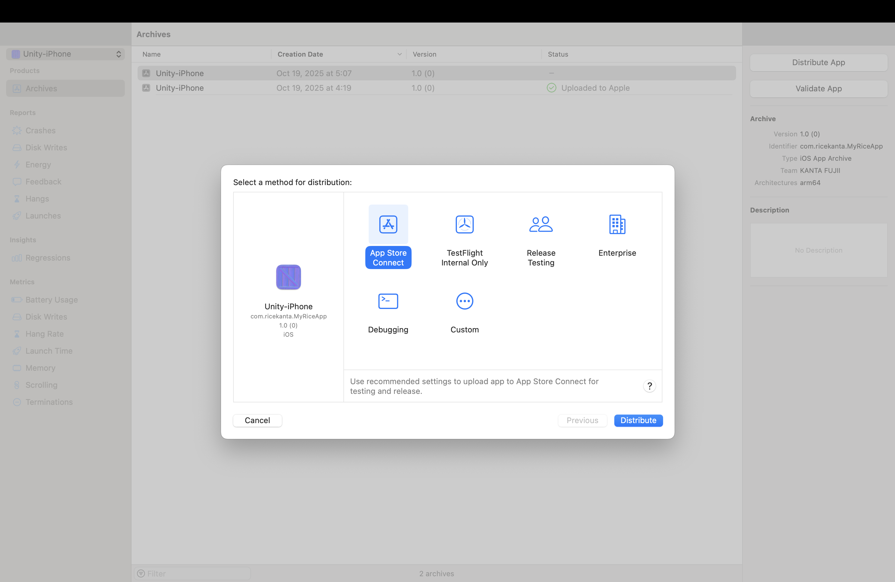

アップロード先を選択:

「Upload」が選択されていることを確認し、「Next」をクリックします。

署名の設定:(きちんとXcodeとApp Store Connectがつながっていれば出てこない予想)

「Automatically manage signing」にチェックが入っていれば、Xcodeが自動でストア提出用の署名を行います。そのまま「Next」をクリックしてください。

アップロードの実行:
サマリーが表示されるので、内容を確認して右下の「Upload」ボタンをクリックします。

アップロードが開始されます。アプリのサイズによっては数分〜数十分かかることがあります。

"Successfully uploaded" と表示されれば完了です！

### 4.App Store Connectで審査を提出する
アップロードが完了したら、App Store Connect側でビルドが処理されるのを待ちます（数分〜1時間程度）。その後、最終的な情報を入力して審査に出します。

ビルド(実際にStoreに出るアプリの内容)＋提出物(審査に必要な要項やストアに出す内容)→提出のイメージ

1. ビルドの選択:

App Store Connectのアプリ情報ページに戻り、「ビルド」のセクションで、先ほどアップロードしたビルドを選択できるようになっているか確認します。

  

2. 提出情報の入力:

- アプリの審査には以下の情報が必須です。左側のメニューを参考に、すべて埋めていきましょう。
- アプリアイコン: 指定されたサイズのアプリアイコン画像。
- スクリーンショット: iPhoneやiPadの各画面サイズのスクリーンショット画像。
- 説明: アプリの説明文。
- キーワード: 検索でヒットさせたい単語。
- サポートURL: あなたの連絡先やアプリのサポート情報が載っているWebページのURL。
- Appのプライバシー: アプリがユーザーのどの情報を収集し、何に使うのかを申告します。正直に回答してください。

3. 審査へ提出:
すべての必須項目を埋めると、画面右上の「審査へ提出」ボタンが青色に変わります。

これをクリックすると、アプリはAppleの審査チームに送られます。

審査には通常1日〜数日かかります。結果はメールで通知されるようです．
