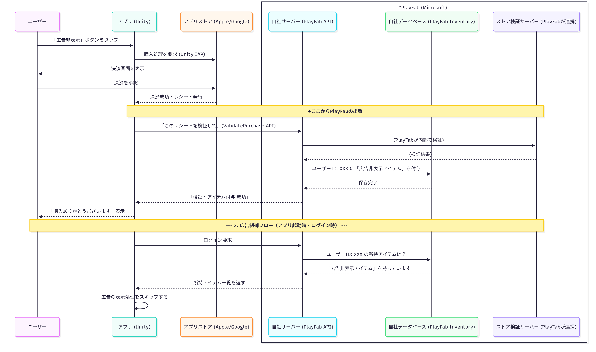

# 課金が完了したユーザ環境では動画広告を表示しない仕組み ローカルまたはサーバ保存なのか

##参考サイト
- https://hirokuma.blog/?p=4454
- https://note.com/08_14/n/nf68b3985784e
- https://developers.wonderpla.net/entry/2021/10/14/151132
- https://qiita.com/ckm/items/b8cf23ba4bd0ae5bbf34

## 概要
1. はじめに
2. ローカル保存
3. サーバ保存
4. 課金状態確認手法
5. ストアレシート検証
6. サーバレス認証
7. 実装

## 1.はじめに
実機の方で，実際に試すことは出来ませんでした...
AndroidはStoreの初期設定で，Androidのバージョンが10以上のものが必要で，研究室に古いandroidのスマホしかなかったです．

以下の文は，調べた内容になります．

そもそも，ローカル保存とサーバ保存について．

サーバ保存パターンがビジネスとしてアプリを運用するうえで基本かつ強力な手法のようです．

## 2.ローカル保存
ローカル保存はユーザが課金したという情報を，ユーザのスマートフォン端末内に直接保存する．

図の表示説明：
- ユーザ：アプリ操作者
- アプリ(クライアント)：ユーザの端末で動作するアプリ本体
- アプリストア：Google Play StoreやApple Store
- ローカルストレージ：端末内のデータ保存領域(UnityならPlayerPrefs)

  

メリット：
- 実装が容易：アプリ(クライアント)側のコードだけで完結
- 高速：端末内のデータを読み込むだけ

デメリット：
- 脆弱なセキュリティ：PlayerPrefs等のローカルデータは知識のあるユーザに簡単に書き換え可能．
- データの永続性の欠如(機種変更・再インストール)：アンインストールするとローカルストレージデータも消えてしまう．機種変更の際に購入状態が引き継がれない．
- 「購入の復元」が必須：上記のデメリットをカバーするために，購入の復元(リストア機能)を別途実施する必要がある．サーバ保存だと，ユーザアカウントに購入履歴等紐づいて保存されるので，機種変しても自動で購入状態が復元されるが，ローカル保存だとサーバに購入したかどうかを確認する動作(ボタン等)が必要になる．(Android)

## 3.サーバ保存
ユーザの課金情報を開発者が用意した自社サーバのデータベースで管理保存する．

図の表示説明：
- ユーザ：アプリ操作者
- アプリ(クライアント)：ユーザの端末で動作するアプリ本体
- アプリストア：Google Play StoreやApple Store
- 自社サーバ：管理者が運用するサーバ
- 自社データベース：購入情報やユーザ情報を格納する場所
- ストア検証サーバ：レシートが本物か検証するためのApple/Googleが提供するサーバ

  

メリット：
- 高いセキュリティ：購入情報が安全な場所に保存．ユーザ側からデータを書き換えることが不可能．レシート検証をサーバ間で行うことでチートを確実に防ぐ．
- 高いデータ永続性(機種変更・再インストール)：購入情報はサーバ上のユーザアカウントに紐づいている．同じアカウントでログインさえすれば，購入状態が自動的に復元．
- 「購入の復元」が不要：ログイン処理で「購入の復元」そのものの役割を果たすので，別途リストアボタンを設けなくていい．

デメリット：
- 実装・運用コスト：サーバの開発・運用コストが継続的に発生．ユーザ認証機能の実装で，システム全体が煩雑に．
- ネットワーク必須：アプリ起動時に，必ず自社サーバと通信して購入状態を確認する必要がある．

まとめ

  

ビジネスで用いる場合は，サーバ保存が必須です．

## 5.ストアレシート認証
レシート検証は自前のサーバからGooglePlayやAppStoreのAPIを通すことでも行うことができる．

  

- 3b-1. ProcessPurchaseでPendingをreturnする：
ストアトランザクションを継続させます
- 3b-2. レシート情報の送信：
自前のサーバにレシートを送信します
- 3b-3. レシート検証：
自前のサーバでGooglePlayやAppStoreのAPIを通してレシート検証を行います。
- 3b-4. レシート検証失敗：
失敗理由を返します
- 3b-5. エラー表示等の処理：
失敗理由に応じて必要な対応を行ってください。
失敗理由には「処理済みレシート」や「不正なレシート」、「ストアサーバの応答なし・タイムアウト」等があります
- 3b-6. ConfirmPendingPurchaseの呼び出し：
処理済みレシートの場合はIStoreController.ConfirmPendingPurchaseを呼び出し、ストアトランザクションを完了させます
それ以外のエラーの場合は呼び出さず、ストアトランザクションを継続させます
- 3b-7. 商品の付与：
購入された商品を付与してください
- b3-8 レシート検証・商品付与成功：
商品付与の結果を返します
- 3b-9. ConfirmPendingPurchaseの呼び出し：
IStoreController.ConfirmPendingPurchaseを呼び出し、ストアトランザクションを完了させます

### 5.1ストアレシート認証の実装
MyServerを立ち上げる必要があります．

検証はレシートを受け取ったアプリの中で行うことも可能で、その方法が公式に紹介されてはいます．ただしユーザの手元にあるアプリ内での検証は、リバースエンジニアリングや通信への中間者攻撃等による不正の可能性を排しきれません。そのため、いずれのストアでもバックエンドサーバーでの検証が推奨されています．

Androidとiosともに検証すべき観点は一緒．
1. 正式なレシートか（ストアの発行したレシートか）
2. 自身のアプリのレシートか
3. 未登録のレシートか

### ios
ストアがAPIとして公開しています．
https://developer.apple.com/documentation/appstorereceipts/verifyreceipt

このAPIは本番環境用とサンドボックス(テスト)環境の二つ分かれており，以下のjsonオブジェクトをボディとしてPOSTリクエストして利用します．
~~~
{
  "receipt-data": "アプリから受信したBase64エンコードされたレシートデータ",
  "password": "アプリの共有シークレット", //reciept-dataが、定期購読のレシートを含む場合のみ必須
  "exclude-old-transactions": true //trueを指定すると、購読の最新レシート1件だけをレスポンスに含めてくれる
}
~~~

審査期間中にAppleがサンドボックス環境のレシートを送信してくるため、「開発時はサンドボックス環境、本番運用時は本番環境用」と設定を切り替えるのではなく、実装としていずれのAPIにもリクエストできるようにしておく必要があります．

戻り値として以下のJSON形式のレスポンスが得られます．

~~~
{
  "status": 0,  //リクエストの結果を表すコード値
  "receipt": {
    "bundle_id": "jp.example.app", //アプリのID
    "in_app": [
      {
        "transaction_id": "1111111111111111", //その1回の購入を一意に識別するためのID 
        "product_id": "jp.example.app.subscription", //購入したアイテムのID
        "purchase_date": "2018-12-11 08:08:50 Etc/GMT", //購入日時（※）
        "expires_date": "2018-12-11 08:08:55 Etc/GMT" //有効期限
      },
    ]
  }, 
  "latest_receipt_info": [
      {
        "product_id": "", 
        "transaction_id": "",
        "purchase_date": "",
        "expires_date": ""
      },
  ], 
  "latest_receipt": "MII...", //Base64エンコードされたレシートデータ。省略しているが、実際は10KB前後の文字列
  "pending_renewal_info": [
    {
      "auto_renew_status": "1", //今の購読が有効期限を迎えた際、自動更新されるか否かを表す値
      "is_in_billing_retry_period": "1" //更新に失敗している購読で、ストアがなお更新を試みているかを表す値
    }
  ]
}

~~~

1. 正当なレシートか

レシートの正当性は、アプリから受け取ったレシートをパラメータとしてAPIにリクエストし、戻り値の項目statusの値で確認します．

| 値 | 説明|
| ---- | ---- |
| 0 | 送信したレシートが有効である。 |
| 21007 | 	送信したレシートはサンドボックス環境のものなので、そちらのAPIを呼び直す。 |
| 他 | 	全量は 公式 を参照。ストアAPIの一時的不具合を表すものもあるが、多くは入力値の不正を示す。 |

2. 自身のアプリのレシートか

自アプリのレシートかは、戻り値の項目receipt:bundle_idで確認します。この値がアプリのCFBundleIdentifierと一致すればOKです。

3. 未登録のレシートか

戻り値に含まれる複数のレシートから最新のもの1つを抽出し、それがサーバーに登録済みか否かを確認します。

## Android
iOS同様に、先にストアが公開しているAPIの使い方を確認しておきます.

GooglePlayのAPIはOAuth 2.0に沿って認可の仕組みを敷いているため、①アクセストークンを取得②取得したトークンを用いて検証のためのAPIにリクエスト、の2ステップで利用します。

①アクセストークンの取得

最初の利用の場合、アプリを公開するGoogleアカウントからリフレッシュトークンを払い出してもらう必要があります。
以下のパラメータで https://accounts.google.com/o/oauth2/token にPOSTリクエストを送信します。
~~~
grant_type=refresh_token
client_id=<アカウントのAPIコンソールで生成したクライアントID>
client_secret=<IDに付随するシークレット>
refresh_token=<リフレッシュトークン>
~~~

grant_typeは"refresh_token"の固定文字列です。
リクエストに成功すると、JSON形式のレスポンスでアクセストークンとその有効期限が返却されます。
~~~
{
  "access_token" : "ya29.AHES3ZQ_MbZCwac9TBWIbjW5ilJkXvLTeSl530Na2",
  "token_type" : "Bearer",
  "expires_in" : 3600,
}
~~~

②APIのリクエスト

次のエンドポイントにGETリクエストを送信します。iOSとは異なり、環境に依らず同じです。

*https://www.googleapis.com/androidpublisher/v3/applications/packageName/purchases/subscriptions/subscriptionId/tokens/*token

| パスパラメータ | 説明|
| ---- | ---- |
| packageName | アプリのパッケージ名 |
| subscriptionID | 	アイテム名 |
| token | アイテム購入時に、端末がストアから受け取るトークン文字列 |

| クエリパラメータ | 説明|
| ---- | ---- |
| access_token | 全ステップで発行したアクセストークン |

リクエストに成功すると、以下のJSON形式のレスポンスが得られます。iOS同様に直近の説明で必要な項目以外は省略しているため、取り上げられなかった項目は 公式 で確認してください。
~~~
{
  "startTimeMillis": 1544515730000,  //購読の開始日時（エポックミリ秒）
  "expiryTimeMillis": 1544516030000, //購読の有効期限
  "autoRenewing": true, //今の購読が有効期限を迎えた際、自動更新されるか否かを表す値
  "developerPayload": "free-text", //アプリから購入を行う際に、個別に指定して埋め込める文字列（※）
  "orderId": "GPA.1111-1111-1111-11111", //その1回の購入を一意に識別するためのID（※※）
  "purchaseType": 0 //サンドボックス環境の時のみ存在し、0を示す
}
~~~

1. 正当なレシートか

アプリはアイテムの購入時、レシートと同時にその署名をストアから受け取っています。サーバーにそのRSA公開鍵を登録しておき、そのセットをSHA-1で検証することでレシートの正当性を担保できます。
Android Developers - Embed your public key for licensing

なお、アプリが購入時に受け取るレシートは以下の内容です。（実際には改行やインデントは含まれません）
~~~
{
  "orderId":"GPA.1111-1111-1111-11111",
  "packageName":"jp.example.app", //アプリを一意に特定できる名前
  "productId":"example", //購入したアイテムのID
  "purchaseTime":1544515730000,
  "purchaseState":0,
  "purchaseToken":"xxx...", //ストアのAPIを利用するためのトークン
  "autoRenewing":true
}
~~~

2. 自身のアプリのレシートか

前ステップで検証したレシートから項目packageName,productId,purchaseTokenを取得し、先述のAPIにリクエストします。そのHTTPステータスコードが 200(OK) であれば、そのレシートは自身のアプリのものです。

3つの項目のセットに対して保持するアクセストークンが適切でない場合、すなわちレシートが自アプリのものではない場合は 400(Bad Request) が返却されます。
アプリのパッケージ名であるpackageNameは不変かつ共通なので、設定値として保持しておいてもよいでしょう。すると他アプリのレシートが送られてきた場合に3つの項目のセット間で不整合が発生し得ますが、その場合もAPIは400を返し、メッセージとしてどこに不整合があるかを教えてくれます。

3. 未登録のレシートか

APIの戻り値の項目orderIdが各購入の識別子です。これと同じ値を持つレシートがDBに登録されていなければ、そのレシートの検証は成功です。
検証済みのレシートとしてDBに保存する際は、アプリから送られてきたレシートとストアのAPIの戻り値を合算して1つのレシートとして保存するようにします。特にproductId,purchaseTokenの値は今後もストアのAPIを利用するのに必須であり、紛失すると何もできなくなってしまいます。

App(検証情報の送信)⇒MyServer(APIリクエストストアサーバに)⇒ストアサーバ

## 6.サーバレス(ローカル)認証
UnityIAPの機能にあるCrossPlatformValidatorを使用するローカルの認証．

  

このシーケンスではすべてIStoreListener.ProcessPurchase内で処理

- 3a-1. レシート検証開始：CrossPlatformValidator.Validateにレシートを設定します
- 3a-2. レシート検証：UnityIAPがGooglePlayやAppStoreを通してレシート検証を行います
- 3a-3. レシート検証失敗：IAPSecurityExceptionがthrowされます
- 3a-4. エラー表示等の処理：
IAPSecurityExceptionのエラー内容の表示等を行います
エラー原因によっては問い合わせへ誘導するなどしたほうがよいと思います
- 3a-5 Pendingをreturnする：
レシート検証に失敗したので、ストアトランザクションを継続させます
- 3a-6. レシート検証成功：
検証に成功したレシート情報が戻されます
GooglePlayとAppStoreで戻されたレシート情報の構成が異なることに注意してください
- 3a-7. 商品の付与：
購入された商品を付与してください
- 3a-8. Completeをreturnする：
ストアトランザクションを完了させます

不正防止の点で，ストアレシート検証が様々な点(特にセキュリティ)で優れていてビジネスで考えるとこちらが必須です．
ただ，ユーザ認証を行い，管理するのでシステム面で複雑化するのと，サーバを持たないといけないのでコストがかかります．

11/12追記

## 参考サイト
- https://playfab-master.com/playfab-unity-iap

## 7.実装
サーバ保存のバックエンド領域をすべて肩代わりしてくれる「Baas(Backend as s Service)」としてMicrosoftが提供している**PlayFab**があります．

  

