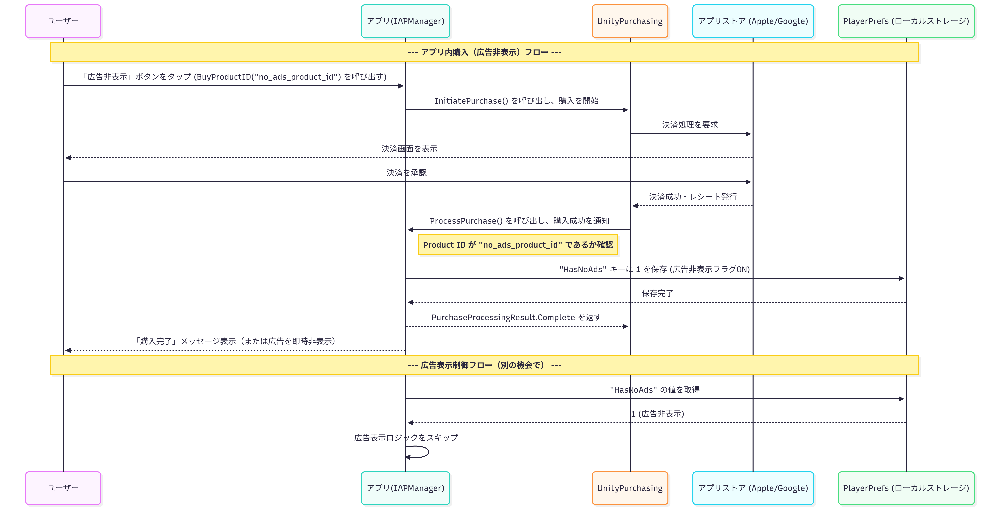
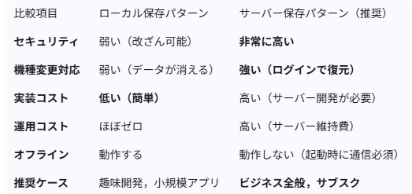

# 課金が完了したユーザ環境では動画広告を表示しない仕組み ローカルまたはサーバ保存なのか

##参考サイト
- https://hirokuma.blog/?p=4454
- https://note.com/08_14/n/nf68b3985784e
- https://developers.wonderpla.net/entry/2021/10/14/151132
- 

## 概要
1. はじめに
2. ローカル保存
3. サーバ保存
4. 課金状態確認手法
5. ストアレシート検証
6. サーバレス認証

## 1.はじめに
実機の方で，実際に試すことは出来ませんでした...
AndroidはStoreの初期設定で，Androidのバージョンが10以上のものが必要で，研究室に古いandroidのスマホしかなかったです．

以下の文は，調べた内容になります．

そもそも，ローカル保存とサーバ保存について．

サーバ保存パターンがビジネスとしてアプリを運用するうえで基本かつ強力な手法のようです．

### 2.ローカル保存
ローカル保存はユーザが課金したという情報を，ユーザのスマートフォン端末内に直接保存する．

図の表示説明：
- ユーザ：アプリ操作者
- アプリ(クライアント)：ユーザの端末で動作するアプリ本体
- アプリストア：Google Play StoreやApple Store
- ローカルストレージ：端末内のデータ保存領域(UnityならPlayerPrefs)

  

メリット：
- 実装が容易：アプリ(クライアント)側のコードだけで完結
- 高速：端末内のデータを読み込むだけ

デメリット：
- 脆弱なセキュリティ：PlayerPrefs等のローカルデータは知識のあるユーザに簡単に書き換え可能．
- データの永続性の欠如(機種変更・再インストール)：アンインストールするとローカルストレージデータも消えてしまう．機種変更の際に購入状態が引き継がれない．
- 「購入の復元」が必須：上記のデメリットをカバーするために，購入の復元(リストア機能)を別途実施する必要がある．サーバ保存だと，ユーザアカウントに購入履歴等紐づいて保存されるので，機種変しても自動で購入状態が復元されるが，ローカル保存だとサーバに購入したかどうかを確認する動作(ボタン等)が必要になる．(Android)

### 3.サーバ保存
ユーザの課金情報を開発者が用意した自社サーバのデータベースで管理保存する．

図の表示説明：
- ユーザ：アプリ操作者
- アプリ(クライアント)：ユーザの端末で動作するアプリ本体
- アプリストア：Google Play StoreやApple Store
- 自社サーバ：管理者が運用するサーバ
- 自社データベース：購入情報やユーザ情報を格納する場所
- ストア検証サーバ：レシートが本物か検証するためのApple/Googleが提供するサーバ

  

メリット：
- 高いセキュリティ：購入情報が安全な場所に保存．ユーザ側からデータを書き換えることが不可能．レシート検証をサーバ間で行うことでチートを確実に防ぐ．
- 高いデータ永続性(機種変更・再インストール)：購入情報はサーバ上のユーザアカウントに紐づいている．同じアカウントでログインさえすれば，購入状態が自動的に復元．
- 「購入の復元」が不要：ログイン処理で「購入の復元」そのものの役割を果たすので，別途リストアボタンを設けなくていい．

デメリット：
- 実装・運用コスト：サーバの開発・運用コストが継続的に発生．ユーザ認証機能の実装で，システム全体が煩雑に．
- ネットワーク必須：アプリ起動時に，必ず自社サーバと通信して購入状態を確認する必要がある．

まとめ

  

ビジネスで用いる場合は，サーバ保存が必須です．

## 5.ストアレシート認証
レシート検証は自前のサーバからGooglePlayやAppStoreのAPIを通すことでも行うことができる．

  

- 3b-1. ProcessPurchaseでPendingをreturnする：
ストアトランザクションを継続させます
- 3b-2. レシート情報の送信：
自前のサーバにレシートを送信します
- 3b-3. レシート検証：
自前のサーバでGooglePlayやAppStoreのAPIを通してレシート検証を行います。
- 3b-4. レシート検証失敗：
失敗理由を返します
- 3b-5. エラー表示等の処理：
失敗理由に応じて必要な対応を行ってください。
失敗理由には「処理済みレシート」や「不正なレシート」、「ストアサーバの応答なし・タイムアウト」等があります
- 3b-6. ConfirmPendingPurchaseの呼び出し：
処理済みレシートの場合はIStoreController.ConfirmPendingPurchaseを呼び出し、ストアトランザクションを完了させます
それ以外のエラーの場合は呼び出さず、ストアトランザクションを継続させます
- 3b-7. 商品の付与：
購入された商品を付与してください
- b3-8 レシート検証・商品付与成功：
商品付与の結果を返します
- 3b-9. ConfirmPendingPurchaseの呼び出し：
IStoreController.ConfirmPendingPurchaseを呼び出し、ストアトランザクションを完了させます

## 6.サーバレス(ローカル)認証
UnityIAPの機能にあるCrossPlatformValidatorを使用するローカルの認証．

  

このシーケンスではすべてIStoreListener.ProcessPurchase内で処理

- 3a-1. レシート検証開始：CrossPlatformValidator.Validateにレシートを設定します
- 3a-2. レシート検証：UnityIAPがGooglePlayやAppStoreを通してレシート検証を行います
- 3a-3. レシート検証失敗：IAPSecurityExceptionがthrowされます
- 3a-4. エラー表示等の処理：
IAPSecurityExceptionのエラー内容の表示等を行います
エラー原因によっては問い合わせへ誘導するなどしたほうがよいと思います
- 3a-5 Pendingをreturnする：
レシート検証に失敗したので、ストアトランザクションを継続させます
- 3a-6. レシート検証成功：
検証に成功したレシート情報が戻されます
GooglePlayとAppStoreで戻されたレシート情報の構成が異なることに注意してください
- 3a-7. 商品の付与：
購入された商品を付与してください
- 3a-8. Completeをreturnする：
ストアトランザクションを完了させます

不正防止の点で，ストアレシート検証が様々な点(特にセキュリティ)で優れていてビジネスで考えるとこちらが必須です．
ただ，ユーザ認証を行い，管理するのでシステム面で複雑化するのと，サーバを持たないといけないのでコストがかかります．