# Unity IAPの導入方法，実装例

## 使用環境
Unity:2022.3.44f1

## 概要
In-App Purchasing (IAP、アプリ内課金) を有効にする方法を説明します。

コード化されたアプローチとコードを使わない方法が用意されており、以下を行うことができます。 
- ユーザーがゲーム内でアイテムを購入するのを可能にします。 
- ストアに接続することで、購入による収益を得ることができます。

### はじめに
1. Unityプロジェクトを開く
2. Window > Package Managerを選びます。Package Manager ウィンドウが表示されます。
3. Package Manager一覧からIn-App Purchasing(IAP)をインストールします

    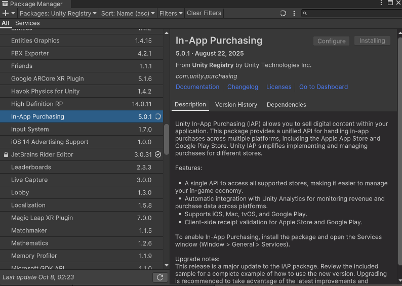

### IAPcatalogの設定
Unity上で商品設定を行います。

後にストアに商品を設定する時は、このカタログのIDと同じにする必要があります。

※Unityからエクスポートしてストアにインポートも可能

Services＞In-App Purchasing＞IAP Catalog...

  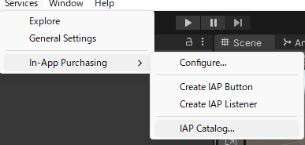

買い切り(広告削除：非消費型)の商品設定を行う

  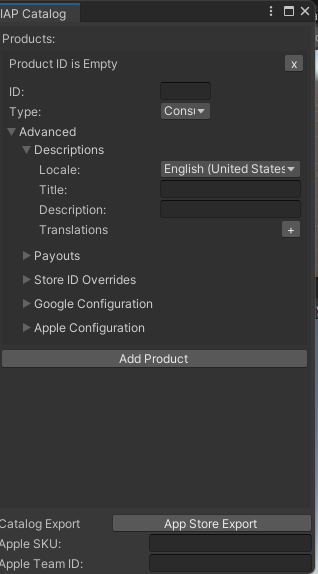

- ID：商品のIDを入力(全部小文字)

他のアプリと重複しないようなID(例com.yourcompany.yourgame.removeads)

使用場所：IAP Catalog，各ストアのサーバ上での設定，購入処理を呼び出すC#スクリプト内で指定するID

- Type：非消費型なのでNonConsumableを選択
- Locale：デフォルトの国
- タイトル：商品名を入力(日本語ok)
- Description：商品の説明を入力(日本語ok)
- Price(Google)：GooglePlayで販売する価格を入力
- PriceTier(Apple)：Appleストアで販売する価格を選択

  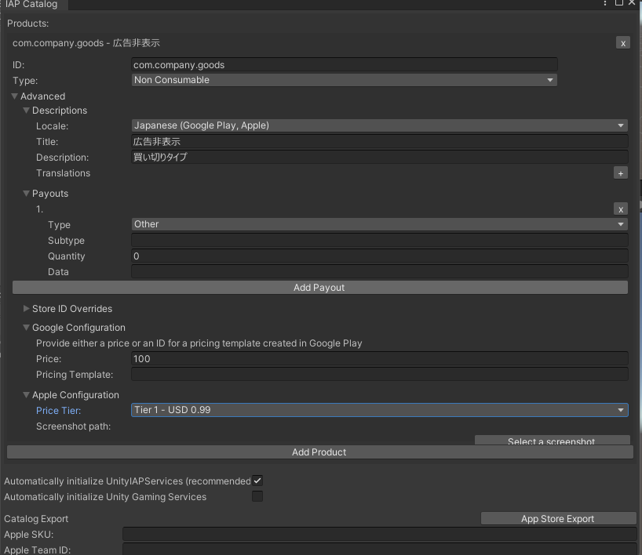

    <a>こんな感じ</a>

## 課金機能の実装

広告を非表示にする課金をコードレスで実装していきます。

コードレスといっても課金機能の部分がコードレスというだけで、基本となるコードは必要です。

まずPurchaseManager.csというスクリプトを作成して、課金に関する処理を記載します。

以下がコードです．

**PurchaseManager.cs**
~~~

using UnityEngine;
using System.Collections;

public class PurchaseManager : MonoBehaviour
{

    public void PurchaseRemoveAds()
    {
        Debug.Log("広告削除を購入成功した時の処理 ");
    }

    public void FailedPurchaseRemoveAds()
    {
        Debug.Log("広告削除を購入失敗した時の処理");
    }

    public void TransactionsResult(bool result, string mess)
    {
        StartCoroutine(RestoreCheck());
    }

    private IEnumerator RestoreCheck()
    {

#if UNITY_ANDROID && !UNITY_EDITOR

        //Androidの場合は自動リストアされるので何もしない
        yield break;

#endif

        yield return new WaitForSeconds(1f);

        if (true)//購入状態チェックしてtrueかどうか
        {
            //購入復元できている時は自動でOnPurchaseCompleteが呼び出されるのでここでは何もしない
        }
        else
        {
            //購入復元できていない時の処理を記載。

        }

    }
}

~~~

購入処理を行うSceneにPurchaseManagerを作成して，IAPButtonを追加．(Scriptも追加)

  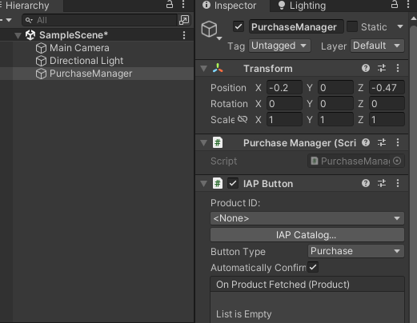

ProductIDにIAPカタログで作成したIDを選択．

  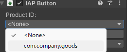

OnPurchaseConfirmedのイベントにPurchaseManagerのPurchaseRemoveAds（）を設定．

OnPurchaseFailedのイベントにPurchaseManagerのFailedPurchaseRemoveAds（）を設定．

  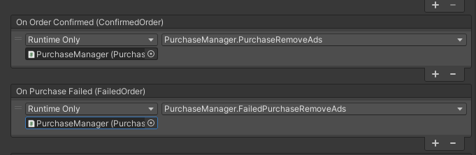

OnProductFetchedは空のままでOK．(商品情報をストアから取得した時の処理らしい)

Buttonにはヒエラルキー上にUIのPurchaseButtonを作成して、それをアタッチする．

  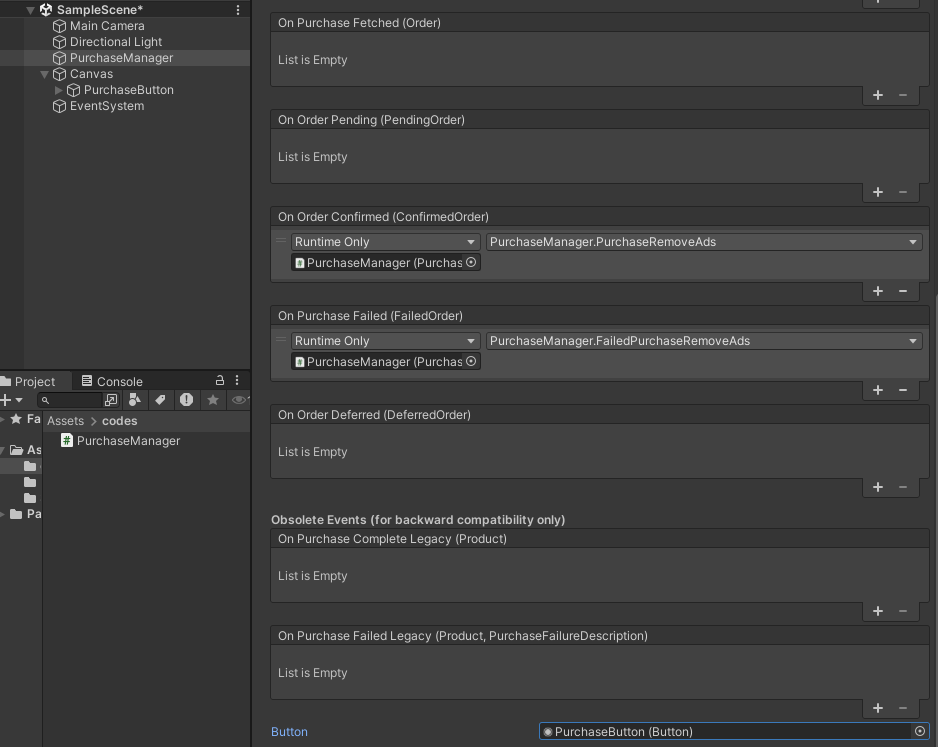

これでPurchaseButtonを押すと、端末の購入処理が呼び出されるようになりました．

対象となる商品はProductIDに設定された商品です。

購入に成功すると、PurchaseRemoveAds()が呼ばれます。

失敗すると、FailedPurchaseRemoveAds()が呼ばれます。

## リストア処理
ユーザーが購入した後にゲームをアンインストールして、再インストールした時などに
購入状態を復元してあげるリストア機能を実装する必要がある．

PurchaseManagerにIAP Buttonを追加して、同じProductIDを選択したら
このIAP Buttonをリストアとして使うためにButtonTypeをRestoreに変更する．

  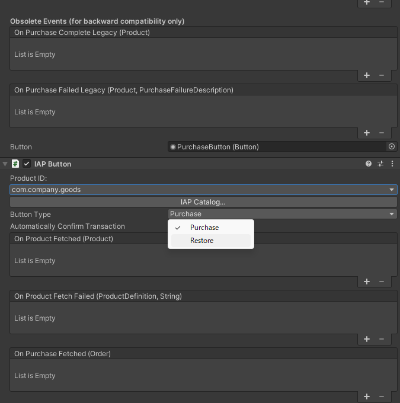

Restore設定したIAP ButtonのOnTransactionsRestoredには
PurchaseManagerのTransactionsResultを設定する．

  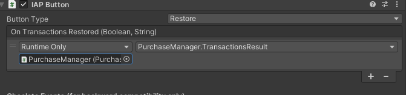

Buttonにはヒエラルキー上にUIのRestoreButtonを作成して、それをアタッチする．

そうするとRestoreButtonが押された時にIAP Buttonの方の処理が走りリストアされ
OnTransactionsRestoredのイベントがコールバックする．

  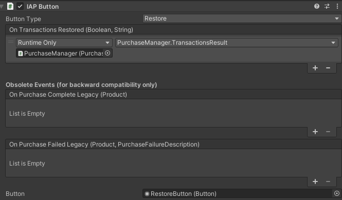

リストアの処理は、GoogleとAppleで違いがあり、Googleの場合は
自動でリストア処理が走るのでリストアボタンを設置しない．
このため起動している端末がどちらのなのかを判定して、Androidだったら
リストアボタンを非表示にする処理は自分で作らないといけない．
iOSの場合は、自動リストア処理は走らないので、ユーザーが自分で
リストアボタンを押さない限り、リストアされない．

なお、リストア成功すると、課金成功時と同じOnPurchaseCompleteが呼ばれます。
リストアの成否によって何か処理をする場合は、OnTransactionsRestoredのBooleanを
成否判定してそれぞれ処理を記載しよう．

## ストア側の設定(Google Play)
ストア側に同じProductIDの商品を登録する．
GooglePlayの場合、先にビルドをアップしないと課金アイテムを登録できないので
審査が不要な内部テストにアップロードしておきましょう．

GooglePlayConsoleに登録できていないため，途中．

## ストア側の設定(Apple Store)
AppleStoreConnectでアプリを登録後、そのアプリのアプリ内課金メニューから商品を登録できます.

