# Apple App Store / Google Play Console における設定・申請フロー

## 使用環境
Unity:2022.3.44f1

参考にしたサイト：
- https://miuragames.com/Tech/Unity-billing#index_A5DUZcMn
- https://study-topia.youtopia-web.com/how-to-unity-iap-by-ios/
- https://zenn.dev/dara/scraps/7b8e7bbc305465
- https://qiita.com/Masataka-n/items/6f98a5a9fee7b28ccd1f

## 概要
1. 各アプリストアでの課金アイテム登録
2. 課金を含むアプリ申請時に必要な設定
3. 審査時に注意するポイント

## 1.各ストアでの課金アイテム登録
## 1.1.IOS側の設定
そもそも・・・

### Apple Developer Programとは
apple store connectの利用にはApple Developer Programへの参加が必須．開発関連リソースや証明書の取得、アプリの配信審査申請、TestFlightによるベータ配信、APIの活用など、すべての機能が利用可能．

### App Store Connectとは
Appleが提供する公式アプリ管理プラットフォーム．iPhoneやiPad，Mac向けアプリの提出，配信，更新作業を一元管理できる．開発者や事業者は，このサービスを通じてアプリの配信設定，審査申請，メタデータや課金情報の編集，売上・利用状況の詳細レポート管理まで幅広く対応可能

この二つの設定が必要になる．

デプロイ後，「App Store Connect」で課金アイテムの登録を行う．(AppStoreにデプロイされている想定の説明をします．)

「App Store Connect」で対象のアプリを開き,「機能」の欄にある「アプリ内課金」を選択します。
その後、「作成」ボタンを押してアイテムの登録を行う．

  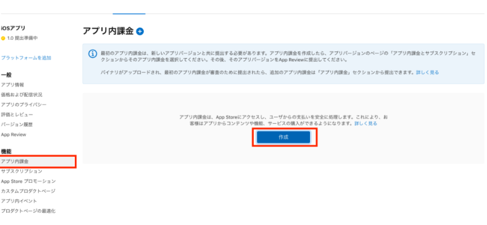

「作成」ボタンを押すと、アイテムの登録画面が開く．

  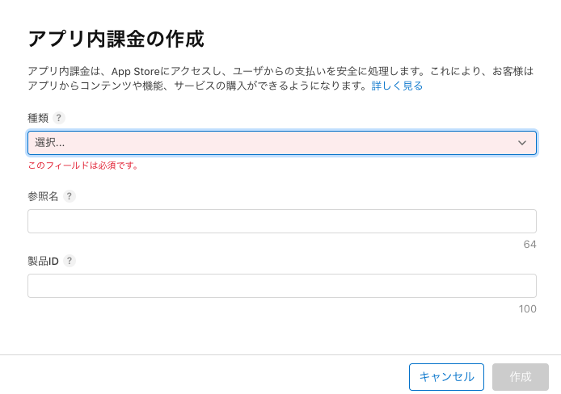

項目

- 種類：消耗型or非消耗型(今回は非消耗)

- 参照名：アイテム名

- 製品ID：UnityIAPで設定したID(今回だとcom.company.goods)

注意として，製品IDとUnityで設定したIDが一致しないと課金アイテムが正常に処理されないので注意．

### 「App Store Connect」で口座登録(重要らしいです)

  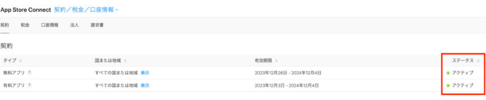

「App Store Connect」の「契約」を開き、「無料アプリ」「有料アプリ」それぞれステータスが「アクティブ」になっていないと、実機で課金テストを行なっても初期化エラーとなりテストが出来ないので必ず行う！

必ず「口座情報」だけではなく「納税フォーム」の申請を行なってください。(ここまで行わないと初期化エラーが発生する)

納税フォーム：https://developer.apple.com/jp/help/app-store-connect/manage-tax-information/provide-tax-information/

### 「App Store Connect」でSandboxアカウントの登録(ここから実機テスト用)
「ユーザーとアクセス」をクリックし、「Sandbox」を選択し、「＋」ボタンからテストアカウントを追加してください。

  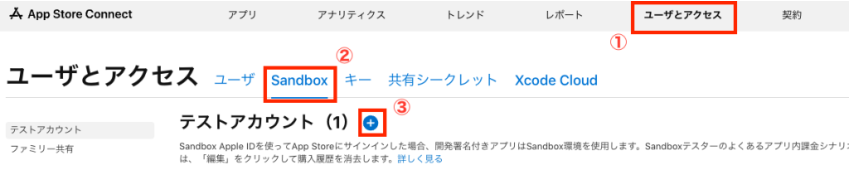

「＋」ボタンを押すと「新規テスター」画面が表示されます.こちらに必要な情報を入力してください．
尚、メールアドレスに関しては実際に存在しないメールアドレスでも良いそうです.実機でテストしたいときに利用？．

  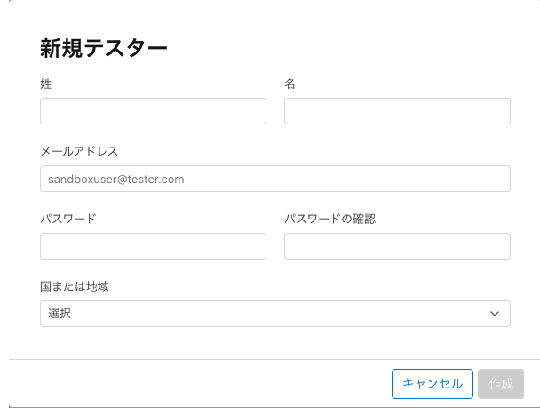

iPhoneで「設定」→「App Store」を開き、Sandboxの欄に「サインイン」が表示されるので、先ほど作成したアカウントでログインを行います。

  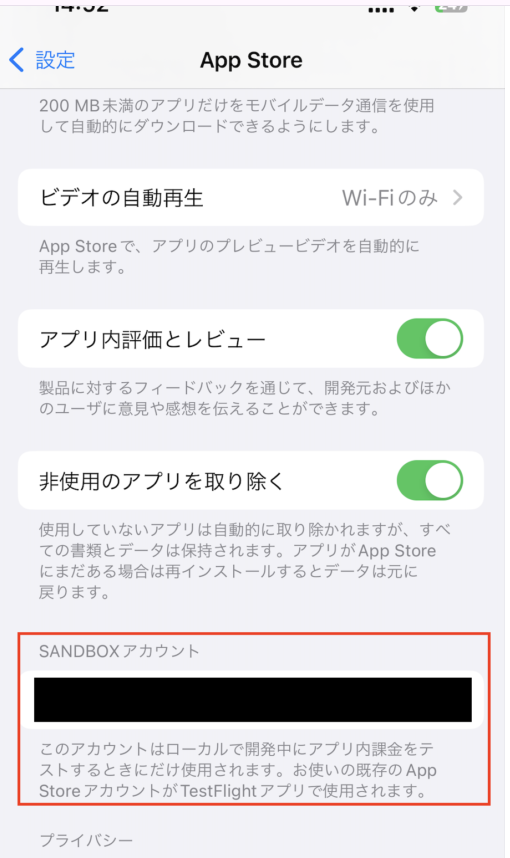

SANDBOX環境に正常にログインできた場合、これで、Unityでアプリをビルドして、Xcodeで実機にインストールすれば、課金テストを行えるようになります。

### ここまでをまとめると...
- 課金アイテムのiosでの登録
- 実機を用いた課金テストの環境構築

### 1.2.Googleの設定
同じID(今回だとcom.company.goods)を設定することでストアとの連携ができるようになります．

GooglePlayの場合、先にビルドをアップしないと課金アイテムを登録できないので審査が不要な内部テストに事前にアップロードをしよう。

  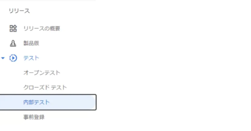

アプリ内アイテムから新規商品を設定します．

  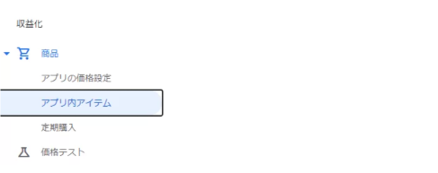

IAPCatalogで設定したProductIDと同じもの記述します。名前と説明も全く同じに記述します.

  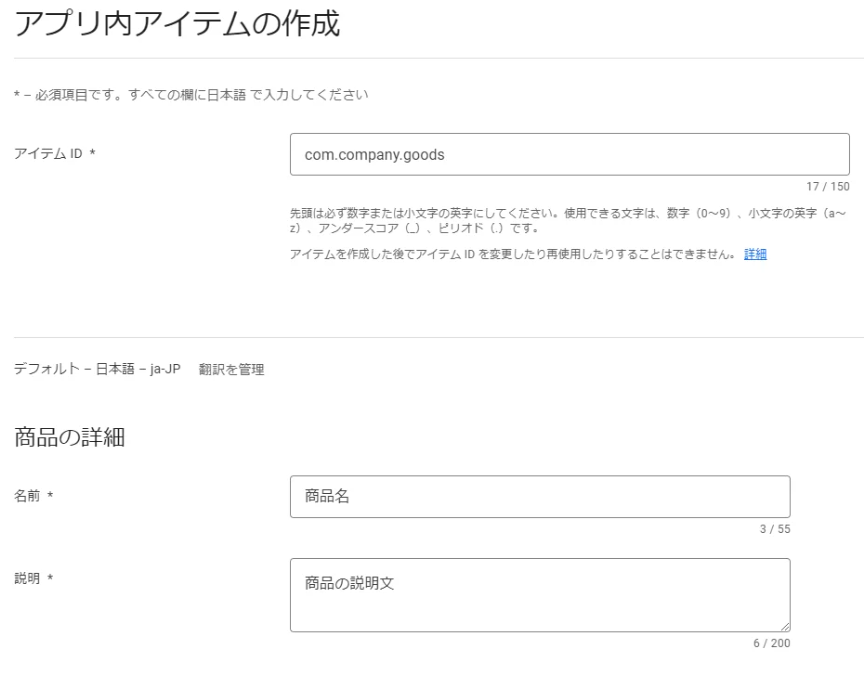

「価格を設定」を押して販売価格を設定します。複数数量はチェックしません。

  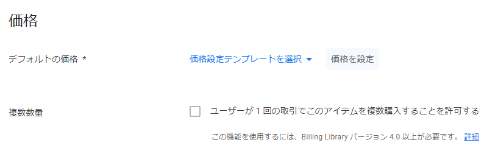

日本円でいくらかを手動で設定します。海外で購入される際の価格は為替レートで自動的に変換されますので、円だけ設定でOKです。

  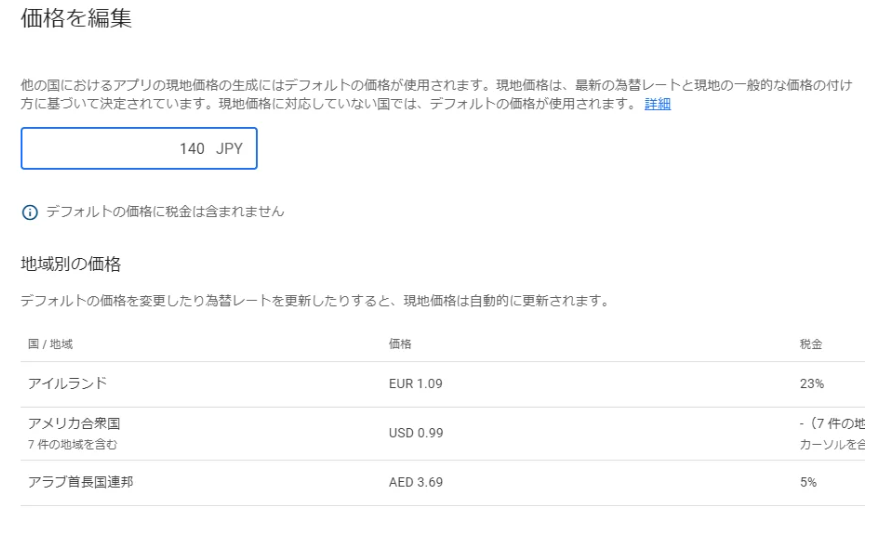

これで商品が追加できたので、実機テストでPurchaseButtonを押してみましょう。
GooglePlayの購入ポップが表示されれば成功です。

### Androidの実機テスト導入
時間がありましたら，まとめます．

https://note.com/tablet_output/n/nd1e98c2f7683

## 2.課金を含むアプリ申請時に必要な設定
1. アプリのデプロイ
2. ストア掲載情報（メタデータ）の入力(ユーザーがストアで目にする情報の設定)
3. 課金アイテム固有の設定と提出物(特にiOSの審査用スクリーンショット)
4. アプリ審査のための情報提供(テスト手順やアカウント)

どの設定の手順書が必要でしょうか？

### 2.1.アプリのデプロイ
### 2.1.1Androidの場合
https://qiita.com/sincegim0211/items/5a1823c200fb283a2e02
これをまとめる予定です．

### 2.1.2iosの場合
以下の流れで連携してデプロイ作業を行います。

Unity → Xcode → App Store Connect
必要なのは，
- Unityのインストール
- Xcodeのインストール
- Apple Developerアカウント登録

## 3.審査時に注意するポイント
- リストア（購入の復元）機能は必ず実装する（特にiOSの買い切りアイテムでは必須）。
- 価格と購入内容をユーザーに明確に表示する。
- 全ての機能が正常に動作する（リンク切れやクラッシュがない）。
- 審査員がテストできるようにする（テスト用の情報や操作手順をメモに記載する）。

