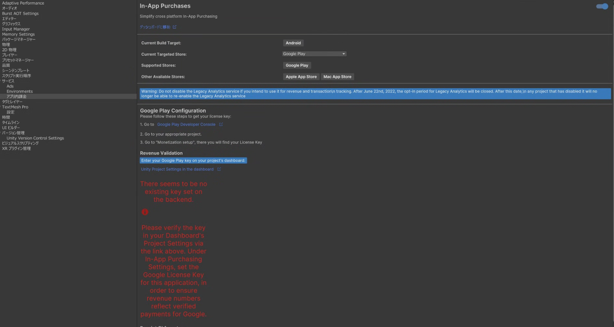

# Unity IAPの導入方法，実装例→ストアの課金アイテム設定

## 使用環境
Unity:2022.3.44f1

参考URL：
- https://miuragames.com/Tech/Unity-billing#index_A5DUZcMn
- https://study-topia.youtopia-web.com/how-to-unity-iap-by-ios/
- https://zenn.dev/dara/scraps/7b8e7bbc305465
- https://qiita.com/Masataka-n/items/6f98a5a9fee7b28ccd1f
- https://tomi-no-tubuyaki.com/game-develop/unity/unity-%E9%9D%9E%E6%B6%88%E8%B2%BB%E5%9E%8B%E8%AA%B2%E9%87%91%E3%82%A2%E3%82%A4%E3%83%86%E3%83%A0%EF%BC%88%E5%BA%83%E5%91%8A%E5%89%8A%E9%99%A4%E3%81%AA%E3%81%A9%EF%BC%89%E3%81%AE%E5%AE%9F%E8%A3%85/

## 概要
以下を行うことができます。 
- ユーザーがゲーム内でアイテムを購入するのを可能にします。 
- ストアに接続することで、購入による収益を得ることができます。

1. はじめに(15に追記)
2. IAPcatalogの設定
3. 課金機能の実施
4. 課金アイテムのストア設定
5. 審査時に注意するポイント

## 1.はじめに
Unityプロジェクトを開く

Window > Package Managerを選びます。Package Manager ウィンドウが表示されます。

Package Manager一覧からIn-App Purchasing(IAP)をインストールします

  

10月20日追記
追記で，IAPサービスの有効化が必要．
1. Services > In-App Purchasing を選択し、設定画面を開きます．
2. Unity Gaming Servicesとの連携を求められた場合は、プロジェクトをリンクしてください．
In-App Purchasing を ON に設定します．

  

### Androidの場合
ONにすると，エラー文出てきます．

  

GooglePlayのライセンスキーが設定されていないとのこと．

写真に書いてある通りに，設定を行う．

1. Google Play Consoleにサインイン
2. アプリの選択
3. ライセンスキーを探す．
   - 左側のメニューから，収益化＞収益のセットアップのページを開く
   - そのページに「ライセンス」というセッションがあり，そこに長い文字列(ライセンスキー)がある．

4. キーをコピーしてUnityに貼り付け
   - ライセンスキーをコピー
   - UnityのProject Setting画面に戻り，写真の「Enter key」と書かれている欄にペースト．
   - 「Obfuscate License Keys」ボタンを押した場合，ライセンスキーを変換する→セキュリティの強化

「Obfuscate License Keys」ボタンの下に，「GooglePlayTangle.cs has been generated and exists in your project」と表示されればOKとのこと

「There seems ~~」のエラー文は残っていますが，気にしなくていいとのこと．

## 2.IAPcatalogの設定
Unity上で商品設定を行います。

後にストアに商品を設定する時は、このカタログのIDと同じにする必要があります。

※Unityからエクスポートしてストアにインポートも可能

Services＞In-App Purchasing＞IAP Catalog...

  

買い切り(広告削除：非消費型)の商品設定を行う

  

- ID：商品のIDを入力(全部小文字)

他のアプリと重複しないようなID(例com.yourcompany.yourgame.removeads)

使用場所：IAP Catalog，各ストアのサーバ上での設定，購入処理を呼び出すC#スクリプト内で指定するID

- Type：非消費型なのでNonConsumableを選択
- Locale：デフォルトの国
- タイトル：商品名を入力(日本語ok)
- Description：商品の説明を入力(日本語ok)
- Price(Google)：GooglePlayで販売する価格を入力
- PriceTier(Apple)：Appleストアで販売する価格を選択

  

    <a>こんな感じ</a>

## 追加：ADS簡単に設定
Unity Cloudで設定，Product＞Unity Ads Monetizationを選択

## 課金機能の実装

広告を非表示にする課金をコードレスで実装していきます。

コードレスといっても課金機能の部分がコードレスというだけで、基本となるコードは必要です。

まずPurchaseManager.csというスクリプトを作成して、課金に関する処理を記載します。

以下がコードです．

**PurchaseManager.cs**
~~~

using UnityEngine;
using System.Collections;

public class PurchaseManager : MonoBehaviour
{

    public void PurchaseRemoveAds()
    {
        Debug.Log("広告削除を購入成功した時の処理 ");
    }

    public void FailedPurchaseRemoveAds()
    {
        Debug.Log("広告削除を購入失敗した時の処理");
    }

    public void TransactionsResult(bool result, string mess)
    {
        StartCoroutine(RestoreCheck());
    }

    private IEnumerator RestoreCheck()
    {

#if UNITY_ANDROID && !UNITY_EDITOR

        //Androidの場合は自動リストアされるので何もしない
        yield break;

#endif

        yield return new WaitForSeconds(1f);

        if (true)//購入状態チェックしてtrueかどうか
        {
            //購入復元できている時は自動でOnPurchaseCompleteが呼び出されるのでここでは何もしない
        }
        else
        {
            //購入復元できていない時の処理を記載。

        }

    }
}

~~~

購入処理を行うSceneにPurchaseManagerを作成して，IAPButtonを追加．(Scriptも追加)

  

ProductIDにIAPカタログで作成したIDを選択．

  

OnPurchaseConfirmedのイベントにPurchaseManagerのPurchaseRemoveAds（）を設定．

OnPurchaseFailedのイベントにPurchaseManagerのFailedPurchaseRemoveAds（）を設定．

  

OnProductFetchedは空のままでOK．(商品情報をストアから取得した時の処理らしい)

Buttonにはヒエラルキー上にUIのPurchaseButtonを作成して、それをアタッチする．

  

これでPurchaseButtonを押すと、端末の購入処理が呼び出されるようになりました．

対象となる商品はProductIDに設定された商品です。

購入に成功すると、PurchaseRemoveAds()が呼ばれます。

失敗すると、FailedPurchaseRemoveAds()が呼ばれます。

## リストア処理
ユーザーが購入した後にゲームをアンインストールして、再インストールした時などに
購入状態を復元してあげるリストア機能を実装する必要がある．

PurchaseManagerにIAP Buttonを追加して、同じProductIDを選択したら
このIAP Buttonをリストアとして使うためにButtonTypeをRestoreに変更する．

  

Restore設定したIAP ButtonのOnTransactionsRestoredには
PurchaseManagerのTransactionsResultを設定する．

  

Buttonにはヒエラルキー上にUIのRestoreButtonを作成して、それをアタッチする．

そうするとRestoreButtonが押された時にIAP Buttonの方の処理が走りリストアされ
OnTransactionsRestoredのイベントがコールバックする．

  

リストアの処理は、GoogleとAppleで違いがあり、Googleの場合は
自動でリストア処理が走るのでリストアボタンを設置しない．
このため起動している端末がどちらのなのかを判定して、Androidだったら
リストアボタンを非表示にする処理は自分で作らないといけない．
iOSの場合は、自動リストア処理は走らないので、ユーザーが自分で
リストアボタンを押さない限り、リストアされない．

なお、リストア成功すると、課金成功時と同じOnPurchaseCompleteが呼ばれます。
リストアの成否によって何か処理をする場合は、OnTransactionsRestoredのBooleanを
成否判定してそれぞれ処理を記載しよう．

## 4.課金アイテムのストア設定
### Android編
まず，ストア側に同じProductIDの商品を登録する．

先に，ビルドしたものをアップしないと課金アイテムの登録ができないので審査が不要な「内部テスト」にアップロードする．

  

テスターの選択→リリースの作成→リリースの確認の流れになります．(ここから自分で確認はできていません)

内部テストにリリースが完了したら，新規商品を追加します．

商品→アプリ内アイテムです．

  

ここで，アイテムIDには，IAPカタログで作成したProduct IDを設定します．

名前も説明もIAPカタログで作成したものと同じです．「価格を設定」を押して販売価格を設定します．

今回は買い切りアイテムなので，複数数量はチェックしません．

  

  

日本円でいくらか手動で設定します．海外で購入する際の価格は，自動的に変換されるので，円だけで大丈夫．

これで，商品の追加ができたので，実機テストでPurchaseButtonを押してGooglePlayの購入ポップが表示されれば成功！！！

### Androidの実機テスト導入
まず，Unity HubからプロジェクトにUnity Build Supportがインストールされているか確認する．

次に端末の設定画面を開く．

  

設定から開発者向けオプションを選択する．

  

開発者モードをONにするだけで端末の設定は完了！．

  

後は，PCと実機をUSBで接続し，UnityでBuild And Runで実行すれば自動でアプリがたちあがります！(保存画面が表示されるのですが、このときAsset以外の場所で保存するように，エラーが起こるっぽいです)

### IOSの設定

そもそも・・・

### Apple Developer Programとは
apple store connectの利用にはApple Developer Programへの参加が必須．開発関連リソースや証明書の取得、アプリの配信審査申請、TestFlightによるベータ配信、APIの活用など、すべての機能が利用可能．

### App Store Connectとは
Appleが提供する公式アプリ管理プラットフォーム．iPhoneやiPad，Mac向けアプリの提出，配信，更新作業を一元管理できる．開発者や事業者は，このサービスを通じてアプリの配信設定，審査申請，メタデータや課金情報の編集，売上・利用状況の詳細レポート管理まで幅広く対応可能

この二つの設定が必要になる．

### 「App Store Connect」で口座登録(重要らしいです)

  

「App Store Connect」の「契約」を開き、「無料アプリ」「有料アプリ」それぞれステータスが「アクティブ」になっていないと、実機で課金テストを行なっても初期化エラーとなりテストが出来ないので必ず行う！

必ず「口座情報」だけではなく「納税フォーム」の申請を行なってください。(ここまで行わないと初期化エラーが発生する)

納税フォーム：https://developer.apple.com/jp/help/app-store-connect/manage-tax-information/provide-tax-information/

App Store Connectにアプリを登録後，そのアプリ内課金メニューから商品を登録できる．

  

項目をそれぞれ説明すると，種類は買い切りなので非消耗型．参照名は，売り上げレポートを見る際の名称．製品IDはIAPカタログのProductIDと一緒です．

  

作成が完了すると，審査前の下書きの状態で登録される．次に，配信する国と価格を設定する．

  

国については，デフォルトで全てであり，配信しない国があればチェックを外す．

  

価格の設定を行う．価格を押すとリストが出るのでそこから選択．下の「他の価格を確認」があるが，これは価格の刻みが細かくなったものである．

AppStoreに課金アイテムを追加する際に審査が必要になる．その時に，スクリーンショットが必要なる．これは，購入ボタンが表示されている画面でいいそう．

スクリーンショットはAppleの指定のサイズを守らないとアップできないので注意．(参考：https://developer.apple.com/help/app-store-connect/reference/screenshot-specifications)

メモには，どういうアイテムか説明することが必要．

ここまでで，アプリ内課金アイテムの追加が終わると，実機でテストできるようになるので，ビルドをストアにアップして実際に購入できるか試すことができる．

### 「App Store Connect」でSandboxアカウントの登録(ここから実機テスト用)
「ユーザーとアクセス」をクリックし、「Sandbox」を選択し、「＋」ボタンからテストアカウントを追加してください。

  

「＋」ボタンを押すと「新規テスター」画面が表示されます.こちらに必要な情報を入力してください．
尚、メールアドレスに関しては実際に存在しないメールアドレスでも良いそうです.実機でテストしたいときに利用？．

  

iPhoneで「設定」→「App Store」を開き、Sandboxの欄に「サインイン」が表示されるので、先ほど作成したアカウントでログインを行います。

  

SANDBOX環境に正常にログインできた場合、これで、Unityでアプリをビルドして、Xcodeで実機にインストールすれば、課金テストを行えるようになります。

## 注意：Unity上でIAPカタログの設定で価格も設定したと思いますが，あれはテスト用・開発のメモ用なので，実際はストアの価格が使われます．

## 5.審査時に注意するポイント
- リストア（購入の復元）機能は必ず実装する（特にiOSの買い切りアイテムでは必須）。
- 価格と購入内容をユーザーに明確に表示する。
- 全ての機能が正常に動作する（リンク切れやクラッシュがない）。
- 審査員がテストできるようにする（テスト用の情報や操作手順をメモに記載する）。